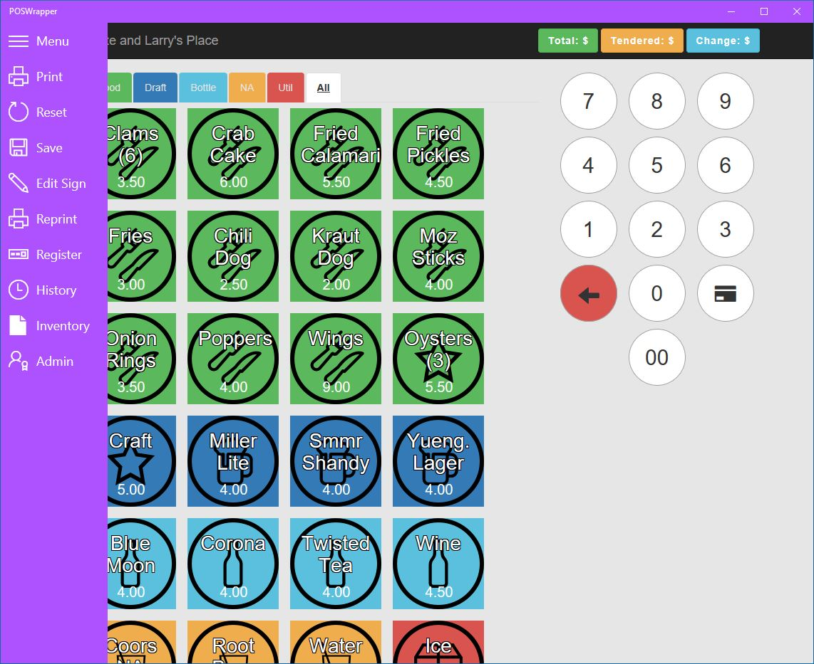

# POSWraper

Simple UWP wrapper for the [SCBCarnivalPPPOS](https://github.com/graboskyc/SCBCarnivalPPPOS).

Put the contents of that repo into WebAssets folder and edit index.html to use Full.css instead of bootstrap.min.css. Other streamlines in progress.

Still hacking away since the printing of UWP web views is a joke...

